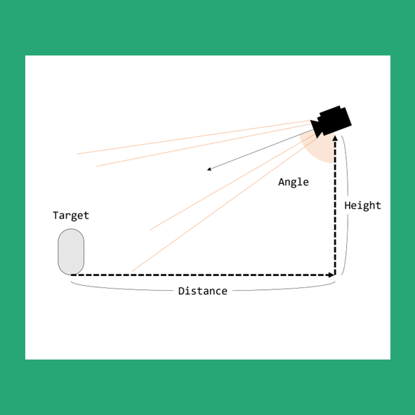

# dynamic-minimap

## 목적



동적으로 미니맵을 생성하고, 상황에 유연하게 대응하기 위함을 목적으로 하고 있습니다.

## 요약

필요한 상황에 맞게, 다양하게 미니맵을 커스터마이징 할 수 있습니다. 단일의 미니맵부터 복수개의 미니맵, Perspective, Orthographic 아이콘 그리고 미니맵 상호작용까지 지원합니다.

### Minimap Builder

미니맵을 생성하기 위한 빌더입니다. 기본적인 주조틀 (Minimap Base)를 바탕으로, 지정된 속성에 맞게 미니맵을 동적으로 생성할 것입니다.
최종적으로 Build 명령의 파라미터로 미니맵의 **Name**을 결정할 수 있습니다.

```csharp
MinimapBuilder minimapBuilder = new MinimapBuilder();

_minimap = minimapBuilder.SetBase(_minimapBase)
    .SetRenderTextureInRawImage(("Basic minimap", _defaultMinimapRawImage))
    .SetTrackingTarget(_trackingTarget.transform)
    .Build("DefaultMinimap");   // 해당 미니맵의 Name은 DefaultMinimap
```

### Minimap Base

프로젝트의 가장 중요 미니맵 주조틀입니다. 현재로는 Perspective Base, Orthographic Base 두 가지를 제공하고 있으며, 필요에 의해 커스터마이징된 Base를 새로 구현할 수 있습니다.


제공된 두 가지의 Base는 Project view에서 생성할 수 있습니다.

#### Orthographic Minimap Base


Orthographic Camera로 구성된 Minimap Base입니다. Inspector에 나타나는 프로퍼티는 다음과 같습니다.

| Property                | Type  | Detail                                                            |
|-------------------------|-------|-------------------------------------------------------------------|
| Default Height          | float | 기본 카메라 높이                                                   |
| Default Size            | float | Orthographic Camera의 기본 Size                                   |
| Default Near Clip Plane | int   | Orthographic Camera의 기본 Near Clip Plane                        |
| Default Far Clip Plane  | int   | Orthographic Camera의 기본 Far Clip Plane                         |
| Zoom Speed              | float | Zoom In&Out의 속도 프로퍼티                                        |
| Min Size                | int   | Orthographic Camera의 최소 Zoom 사이즈 (Default Size와 Dependency) |
| Max Size                | int   | Orthographic Camera의 최대 Zoom 사이즈 (Default Size와 Dependency) |
| Move Speed              | float | Minimap 이동 속도                                                 |

#### Perspective Minimap Base


Perspective Camera로 구성된 Minimap Base입니다. Inspector에 나타나는 프로퍼티는 다음과 같습니다.

| Property                | Type  | Detail                                                                        |
|-------------------------|-------|-------------------------------------------------------------------------------|
| Default Height          | float | 기본 카메라 높이                                                               |
| Default Distance        | float | Perspective Camera가 대상으로부터 떨어진 기본 거리                              |
| Default Angle           | float | Perspective Camera가 대상을 바라보는 기본 각도                                  |
| Default FOV             | float | Perspective Camera의 기본 Field Of View                                       |
| Default Near Clip Plane | int   | Perspective Camera의 기본 Near Clip Plane                                     |
| Default Far Clip Plane  | int   | Perspective Camera의 기본 Far Clip Plane                                      |
| Zoom Speed              | float | Zoom In&Out의 속도 프로퍼티                                                    |
| Min Magnification       | float | Perspective Camera의 최소 Zoom 사이즈 (Default Distance와 Height에 Dependency) |
| Max Magnification       | float | Perspective Camera의 최대 Zoom 사이즈 (Default Distance와 Height에 Dependency) |
| Move Speed              | float | Minimap 이동 속도                                                             |

#### 공통 사항

Minimap Base가 공통적으로 갖는 프로퍼티입니다.

| World Configuration | Type    | Detail     |
|---------------------|---------|------------|
| World Center        | vector2 | 맵의 중심지 |
| World Width         | float   | 맵의 가로폭 |
| World Height        | float   | 맵의 세로폭 |

| Minimap Icons | Type       | Detail                   |
|---------------|------------|--------------------------|
| Tag           | string     | 미니맵 아이콘이 할당될 Tag |
| Icon Prefab   | GameObject | 생성될 아이콘 프리팹       |

미니맵은 Runtime에 빌드되어 사용될 때, Tag 기반으로 Scene내 대상 GameObject를 실시간으로 찾습니다.

### MinimapIconSetterBase


여러분들이 생성한 미니맵은 미니맵에 렌더링할 게임 오브젝트의 아이콘을 생성하게 됩니다. 해당 Component가 붙은 GameObject를 대상으로 탐색을 진행하며, 찾은 대상의 MinimapIconSetterBase 내 Minimap Name 필드로 명명된 미니맵 인스턴스를 찾습니다. 그 후, 해당 인스턴스의 MinimapBase에 등록한 아이콘 중, 아이콘을 렌더링할 게임 오브젝트의 태그와 동일한 아이콘 프리팹을 동적으로 생성합니다.

#### MinimapTextSetter

미니맵 아이콘 대신, 텍스트를 렌더링합니다. TextMeshPro가 필요합니다.

### 설치

1. 몇 가지 플러그인에 Dependency가 존재하므로, 중복되지 않는지 확인하시길 바랍니다.

| name        | url                                | version |
|-------------|------------------------------------|---------|
| UniRX       | https://github.com/neuecc/UniRx    | 7.1.0   |
| TextMeshPro | Unity package manager              | 3.0.6   |

2. [Unity Package](https://github.com/Kunnymann/unity-minimap/releases)를 다운 받아, Import합니다.

### 사용법

1. 원하는 MinimapBase를 생성하여, 설정합니다.
2. 미니맵에 아이콘을 랜더링시킬 GameObject에 적정한 태그를 등록합니다.


3. 아이콘 프리팹을 생성한 후, Layer를 MinimapIcon으로 바꿉니다.


4. 이제, 생성된 MinimapBase에 앞서 제작한 미니맵 아이콘을 할당해 줍니다.


5. 메인 카메라의 Culling Mask에서 MinimapIcon Layer를 제거합니다.
6. 미니맵 빌드 코드를 작성합니다.
```csharp
using minimap.runtime;
...

MinimapSetter _minimapCamera;   // ScriptableObject 형태의 MinimapSetter
GameObject _trackingTarget;     // Minimap Camera의 Tracking target

RawImage _defaultMinimapRawImage;   // 기본 RawImage
RawImage _extendedMinimapRawImage;  // 확대 RawImage
...

private void Start ()
{
    MinimapBuilder minimapBuilder = new MinimapBuilder();

    _minimap = minimapBuilder.SetBase(_minimapBase)
        .SetRenderTextureInRawImage(("Basic minimap", _defaultMinimapRawImage),     // Basic minimap 키의 RawImage 등록
                                    ("Extended minimap", _extendedMinimapRawImage)) // Extended minimap 키의 RawImage 등록
        .AddOnChangeListener(("Basic minimap", (renderTexture) => ActiveDefaultMinimap(renderTexture)), 
                                ("Extended minimap", (renderTexture) => ActiveExtendedMinimap(renderTexture)))
        .SetTrackingTarget(_trackingTarget.transform)
        .Build("DefaultMinimap");

    _minimap.Run("Basic minimap");

    _minimapMinimizeButton.onClick.AddListener(OnClickMinimapMinimize);
    _minimapMaximizeButton.onClick.AddListener(OnClickMinimapMaximize);

    _extendedMinimapHoverManager = _extendedMinimapRawImage.gameObject.AddComponent<RawImageHoverManager>();
}

private void OnClickMinimapMaximize()
{
    if (_minimap.CurrentRenderTextureKey == "Extended minimap")
        return;
    _minimap.Run("Extended minimap");
}

private void OnClickMinimapMinimize()
{
    if (_minimap.CurrentRenderTextureKey == "Basic minimap")
        return;
    _minimap.Run("Basic minimap");
}

private void ActiveDefaultMinimap(RenderTexture renderTexture)
{
    // Do something
}

private void ActiveExtendedMinimap(RenderTexture renderTexture)
{
    // Do something
}

```

## 예제

*MinimapTestScene 참고*

- MinimapTestScene에서는 미리 Minimap Creator로 생성된 Perspective Minimap, Orthographic Minimap을 할당하여, 각기 테스트를 수행할 수 있음.


